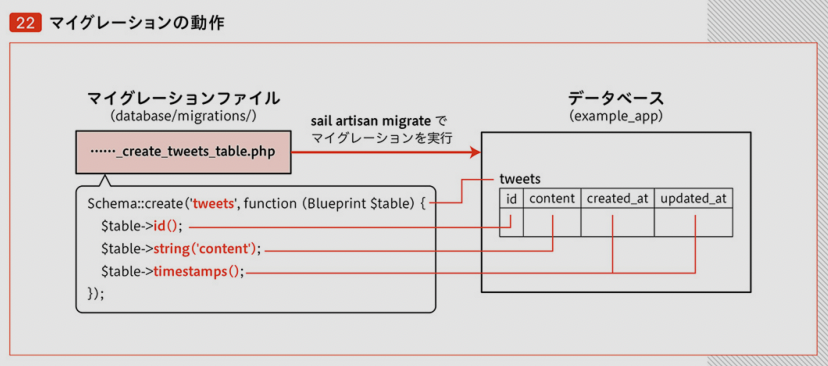
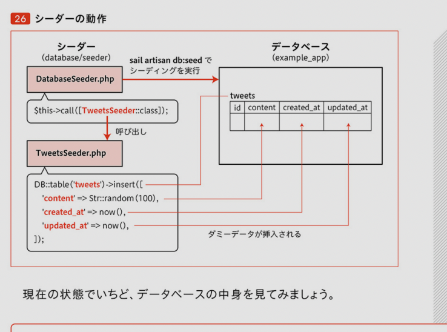
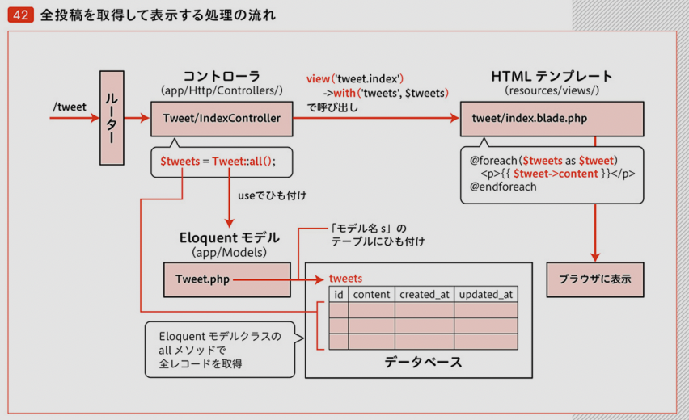
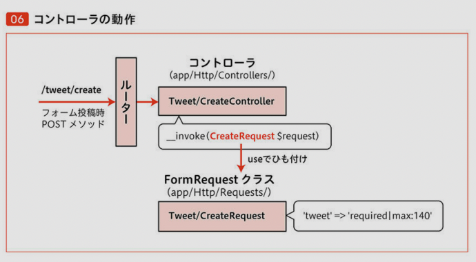

### chap1

■P037 sailコマンド使えるようになる
```
docker run --rm \
    -u "$(id -u):$(id -g)" \
    -v $(pwd):/var/www/html \
    -w /var/www/html \
    laravelsail/php81-composer:latest \
    composer install --ignore-platform-reqs
```

### chap2
■コントローラー作成

■sail コマンドで
```
❯ sail artisan make:controller Sample/IndexContoroller 
Controller created successfully.
```

■ルーティング ... ルーターからコントローラへ適切なものへ結びつける

■web.php  
`Route::get('/sample', [\App\Http\Controllers\Sample\IndexContoroller::class, 'show']);`  
sampkeにアクセスあったら上記showメソッドへルーティングされる

■ルーティング設定  
my-laravel9/app/Http/Controllers/Sample/IndexContoroller.php  
my-laravel9/routes/web.php  
rotesでurl→コントローラー  
**一つのコントローラーに2つのエンドポイントがルーティングされた**

■シングルアクションコントローラー  
1対1の関係  
```
❯ sail artisan make:controller Tweet/IndexController --invokable
Controller created successfully.
```
`--invokable` phpのマジックメソッド  

■エラーの対応  
・起こったエラー  
controllerのファイル名を変更  
not found  
・
https://qiita.com/k-tabuchi/items/a2e4b402eb7113abfa1f
>1.Controllerのファイル名を変更する。  
>2.Controllerファイルを開いて、Class名を変更する。  
>3.web.phpを開いて、第二引数の@の前の部分を手順2のClass名に差し替える。  
>4.以下をターミナルで実行する。  
`composer dump-autoload`  

■コントローラーからHTMLテンプレ呼び出し  
`my-laravel9/resources/views/tweet/index.blade.php`  
`my-laravel9/app/Http/Controllers/Tweet/IndexController.php`  
<p></p> 

■つぶやき一覧の表示機能実装
- db  
- dbのテーブル  
- 開発データ一括挿入  
- appとdbを接続してつぶやき一覧表示  

```
mysql> select version();
+-----------+
| version() |
+-----------+
| 8.0.29    |
+-----------+
1 row in set (0.01 sec)

mysql> show databases;
+--------------------+
| Database           |
+--------------------+
| example_app        |
| information_schema |
| testing            |
+--------------------+
3 rows in set (0.01 sec)
```

db作成  
`sail artisan make:migration create_tweets_table`  
下記に作成された  
my-laravel9/database/migrations/2022_07_14_030453_create_tweets_table.php  

```
mysql> show tables from example_app;
+------------------------+
| Tables_in_example_app  |
+------------------------+
| failed_jobs            |
| migrations             |
| password_resets        |
| personal_access_tokens |
| tweets                 |
| users                  |
+------------------------+
6 rows in set (0.00 sec)
```

テーブル作成確認  
mysql> use example_app;
Database changed
mysql> show columns from tweets;
+------------+-----------------+------+-----+---------+----------------+
| Field      | Type            | Null | Key | Default | Extra          |
+------------+-----------------+------+-----+---------+----------------+
| id         | bigint unsigned | NO   | PRI | NULL    | auto_increment |
| content    | varchar(255)    | NO   |     | NULL    |                |
| created_at | timestamp       | YES  |     | NULL    |                |
| updated_at | timestamp       | YES  |     | NULL    |                |
+------------+-----------------+------+-----+---------+----------------+
4 rows in set (0.03 sec)

■マイグレーションの動作  
<p></p> 

■シーダー一括&実行   
❯ sail artisan make:seeder TweetsSeeder
Seeder created successfully.

シーティング済み
```
my-laravel9 on  master [!+?] via  v16.13.1 via 🐘 v8.1.7 took 2s 
❯ sail artisan db:seed
Seeding: Database\Seeders\TweetsSeeder
Seeded:  Database\Seeders\TweetsSeeder (59.01ms)
Database seeding completed successfully.
```

■シーダーの動作  
<p></p> 

■dbの確認  
```
mysql> use example_app;
Database changed
mysql> select * from tweets;
+----+------------------------------------------------------------------------------------------------------+---------------------+---------------------+
| id | content                                                                                              | created_at          | updated_at          |
+----+------------------------------------------------------------------------------------------------------+---------------------+---------------------+
|  1 | lNqeP8qYDoraFjJQDjdqDfog3KutxPZ7XojW0atjy0CthULpfQlty6bfStkDH05ommRlmROIS8nXgIH5JdOjdFVgnIcvFosB0aFt | 2022-07-14 03:24:58 | 2022-07-14 03:24:58 |
|  2 | p50oGqKwEaIc75K9rb2JPqL0G0rh2z2zJHysS8H5XXs8njxPNSsqh7Tq61EwLVBWEdJJFL26AIuRNBSbqmQ2UFKr4oEUMmWAoGwX | 2022-07-14 03:26:35 | 2022-07-14 03:26:35 |
+----+------------------------------------------------------------------------------------------------------+---------------------+---------------------+
2 rows in set (0.00 sec)
```

**続き**  
■Eloquentモデル〜  
20%まで  

■Eloquentモデル作成
`sail artisan make:model Tweet`  

■Factory作成
`sail artisan make:factory TweetFactory --model=Tweet`  

つまり  
https://qiita.com/Hashimoto-Noriaki/items/b9c40f86c2a59728be0b

**■エラー解決**  
`my-laravel9/app/Models/Tweet.php`を変更  
`protected $table = ‘tweet’;`がじゃましてた  

■シーダーの動作  
<p></p> 

0718~

■コントローラー作成  
`sail artisan make:controller Tweet/CreateController --invokable  
Controller created successfully.`

バリデーション参考  
https://readouble.com/laravel/9.x/ja/validation.html  

■コントローラーの動作  
<p></p> 
