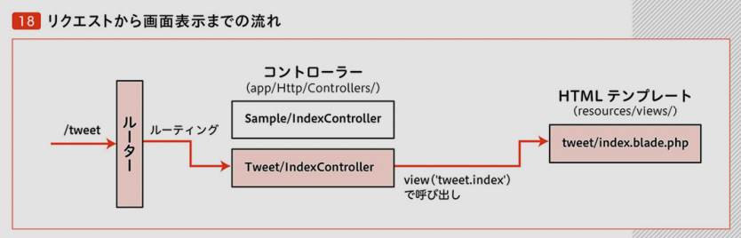

### chap1

■P037 sailコマンド使えるようになる
```
docker run --rm \
    -u "$(id -u):$(id -g)" \
    -v $(pwd):/var/www/html \
    -w /var/www/html \
    laravelsail/php81-composer:latest \
    composer install --ignore-platform-reqs
```

### chap2
■コントローラー作成

■sail コマンドで
```
❯ sail artisan make:controller Sample/IndexContoroller 
Controller created successfully.
```

■ルーティング ... ルーターからコントローラへ適切なものへ結びつける

■web.php  
`Route::get('/sample', [\App\Http\Controllers\Sample\IndexContoroller::class, 'show']);`  
sampkeにアクセスあったら上記showメソッドへルーティングされる

■ルーティング設定  
my-laravel9/app/Http/Controllers/Sample/IndexContoroller.php  
my-laravel9/routes/web.php  
rotesでurl→コントローラー  
**一つのコントローラーに2つのエンドポイントがルーティングされた**

■シングルアクションコントローラー  
1対1の関係  
```
❯ sail artisan make:controller Tweet/IndexController --invokable
Controller created successfully.
```
`--invokable` phpのマジックメソッド  

■エラーの対応  
・起こったエラー  
controllerのファイル名を変更  
not found  
・
https://qiita.com/k-tabuchi/items/a2e4b402eb7113abfa1f
>1.Controllerのファイル名を変更する。  
>2.Controllerファイルを開いて、Class名を変更する。  
>3.web.phpを開いて、第二引数の@の前の部分を手順2のClass名に差し替える。  
>4.以下をターミナルで実行する。  
`composer dump-autoload`  

■コントローラーからHTMLテンプレ呼び出し  
`my-laravel9/resources/views/tweet/index.blade.php`  
`my-laravel9/app/Http/Controllers/Tweet/IndexController.php`  
<p></p> 

■つぶやき一覧の表示機能実装
- db  
- dbのテーブル  
- 開発データ一括挿入  
- appとdbを接続してつぶやき一覧表示  

```
mysql> select version();
+-----------+
| version() |
+-----------+
| 8.0.29    |
+-----------+
1 row in set (0.01 sec)
```
